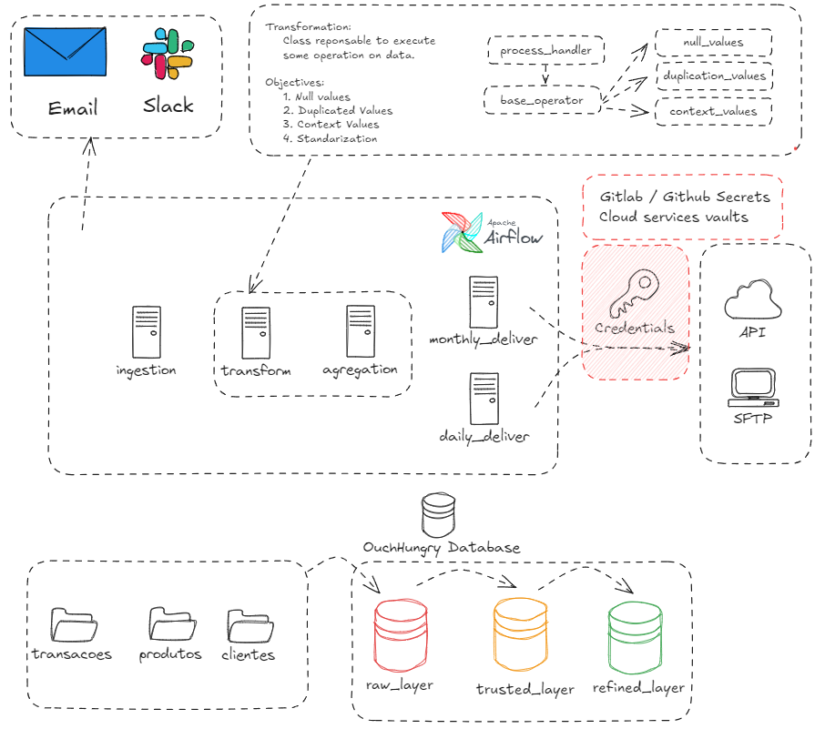
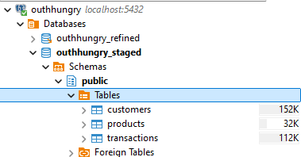
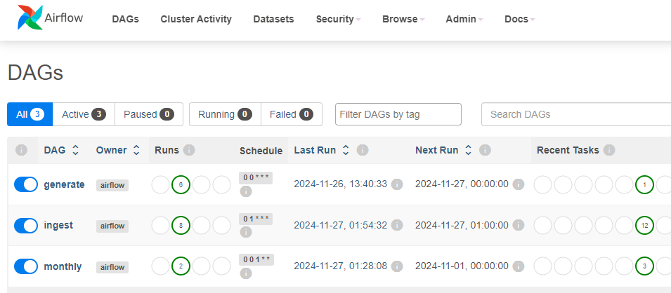
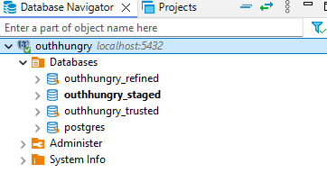

# Etapa 2. Analítico

## Objetivo

O objetivo deste pipeline é entregar um fluxo completo de dados respeitando as regras de negócio descritas no caso de uso.

---

## Arquitetura




Este projeto é responsável por gerar, transformar e processar dados fictícios para as tabelas `customers`, `products` e `transactions`. A arquitetura é composta pelos seguintes componentes principais:

1. **Banco de Dados Postgres**:
   - Três databases configuradas:
     - **staged**: Armazena dados brutos após a ingestão inicial.
     - **trusted**: Contém dados transformados e validados.
     - **refined**: Possui dados refinados e agregados.



2. **Orquestração com Apache Airflow**:
   - Três DAGs principais controlam os processos:
     - **generate**: Gera dados fictícios em formato JSON particionado por dia na pasta `data`.
     - **ingest**: Realiza a ingestão e transformação dos dados, incluindo formatação, validação, deduplicação, envio para uma API e SFTP.
     - **monthly**: Cria tabelas agregadas com métricas por cidade e por produto.



---

## Desafios

### 1. Criação e Limpeza de Base
Foi desenvolvida uma classe chamada [*Transform*](airflow/dags/transform/operations/base.py), que:
- Permite a criação de novas operações de transformação.
- Oferece alta modularidade, facilitando a reutilização de funções.

### 2. Envio Seguro de Dados
- Criadas funções para simular o envio seguro de dados via API e SFTP.
- Foi implementada a função [get_secrets_from_vault](airflow/dags/transform/utils/vault.py) para simular conexões seguras com um **Azure Vault** ou **AWS Secrets Manager**.

### 3. Automação de Processos
- Configuração dinâmica de tasks nas DAGs utilizando um [arquivo de configuração](airflow/dags/transform/config/tasks_ingest.yaml).
- Logs detalhados para monitoramento e alertas configurados para falhas.

### 4. Guardrails e Monitoramento
- Envio automático de [e-mails](airflow/dags/ingest.py) em caso de falha nas tasks.
- Configurações robustas para garantir integridade no pipeline.

---

## Pontos de Melhoria

1. Automatizar a criação das tabelas.
2. Documentar melhor as funções desenvolvidas.
3. Implementar notificações em ferramentas como Slack ou Microsoft Teams.
4. Garantir que a DAG **monthly** só seja executada após a conclusão da DAG **ingest**.

---

## Requisitos

- **Docker**
- **Docker-Compose**

---

## Como Instalar

1. Clone o repositório:

   ```bash
   git clone <URL_DO_REPOSITORIO>
   cd <PASTA_DO_PROJETO>
   ```

2. Construa e inicie os containers:

   ```bash
   docker-compose build
   docker-compose up
   ```

3. Acesse o Airflow pelo endpoint: [http://localhost:8080](http://localhost:8080)
   - **Usuário**: `airflow`
   - **Senha**: `airflow`

4. Crie as databases e tabelas conforme descrito abaixo.

---

## Configuração do Banco de Dados



### Database: `outhhungry_staged`

```sql
CREATE TABLE products (
    id VARCHAR PRIMARY KEY,
    description VARCHAR,
    category VARCHAR,
    ean VARCHAR,
    price FLOAT,
    created_at TIMESTAMP
);

CREATE TABLE customers (
    id VARCHAR PRIMARY KEY,
    first_name VARCHAR,
    last_name VARCHAR,
    email VARCHAR,
    cep VARCHAR,
    ddd INTEGER,
    phone VARCHAR,
    created_at TIMESTAMP
);

DROP TABLE IF EXISTS transactions;
CREATE TABLE transactions (
    id VARCHAR PRIMARY KEY,
    customer_id VARCHAR,
    product_id VARCHAR,
    city VARCHAR,
    created_at TIMESTAMP
);
```

### Database: `outhhungry_trusted`

```sql
CREATE TABLE products (
    id_product VARCHAR PRIMARY KEY,
    nm_description VARCHAR,
    nm_category VARCHAR,
    cd_ean VARCHAR,
    vl_price FLOAT,
    dt_created_at TIMESTAMP
);

CREATE TABLE customers (
    id_customer VARCHAR PRIMARY KEY,
    nm_first_name VARCHAR,
    nm_last_name VARCHAR,
    nm_email VARCHAR,
    cd_cep VARCHAR,
    cd_ddd INTEGER,
    cd_phone VARCHAR,
    dt_created_at TIMESTAMP
);

CREATE TABLE transactions (
    id_transaction VARCHAR PRIMARY KEY,
    id_customer VARCHAR,
    id_product VARCHAR,
    nm_city VARCHAR,
    dt_created_at TIMESTAMP
);
```

### Database: `outhhungry_refined`

```sql
CREATE TABLE sales_metrics (
    nm_city VARCHAR,
    nm_description VARCHAR,
    vl_sales INTEGER,
    vl_active_customers INTEGER,
    vl_revenue FLOAT,
    dt_created_at TIMESTAMP,
    PRIMARY KEY (nm_city, nm_description, dt_created_at)
);
```

---

## Execução do Pipeline

Com as configurações acima concluídas, o ambiente está pronto para iniciar o pipeline de dados. Use o Airflow para monitorar e executar as DAGs configuradas.
